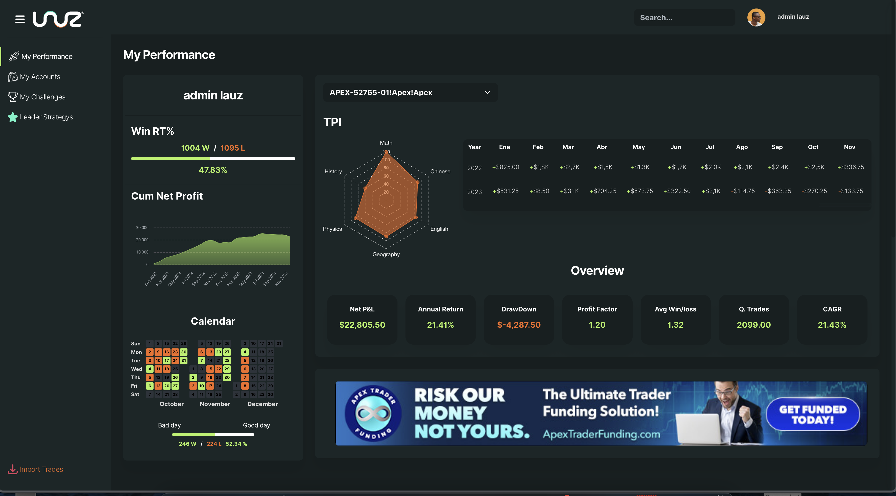
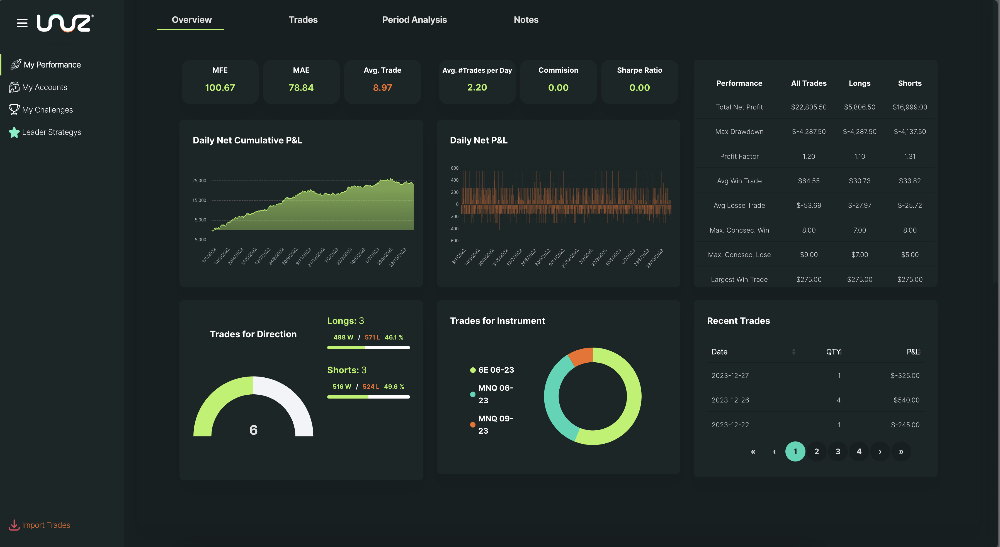

# [Lauz Software]()

# LAUZ

🚀 **LAUZ** is an advanced trading platform that offers a variety of tools designed to enhance the experience and success of traders.

## Features

📊 **Journal Web**: Users can conduct detailed analyses of their trades, access precise statistics, and evaluate their trading strategies.

🔄 **CopyTrading**: Follow and copy the strategies of successful traders, intelligently diversifying your portfolio.

🤖 **AI Advisor**: Get personalized recommendations and advice tailored to your trading habits and preferences.

🎓 **Educational Component**: Guided by achievements and challenges to encourage continuous learning and constant improvement in trading.

## Benefits

-   **Detailed Analysis**: Understand your trading patterns and improve your strategies.
-   **Diversification**: Enhance your portfolio by mimicking successful traders.
-   **Personalized Advice**: Receive tips and strategies from an AI tailored to you.
-   **Continuous Learning**: Engage in educational activities to stay ahead in the trading game.

Join **LAUZ** today and take your trading to the next level! 💼📈

## Requirements

| Package               | Version  |
| --------------------- | -------- |
| PHP                   | ^8.1     |
| Laravel               | 10.48.10 |
| google/cloud-bigquery | ^1.28    |

## ScreenShots

